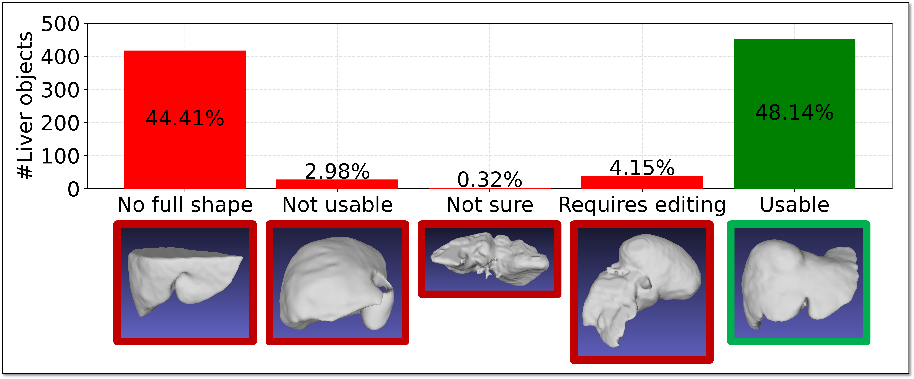
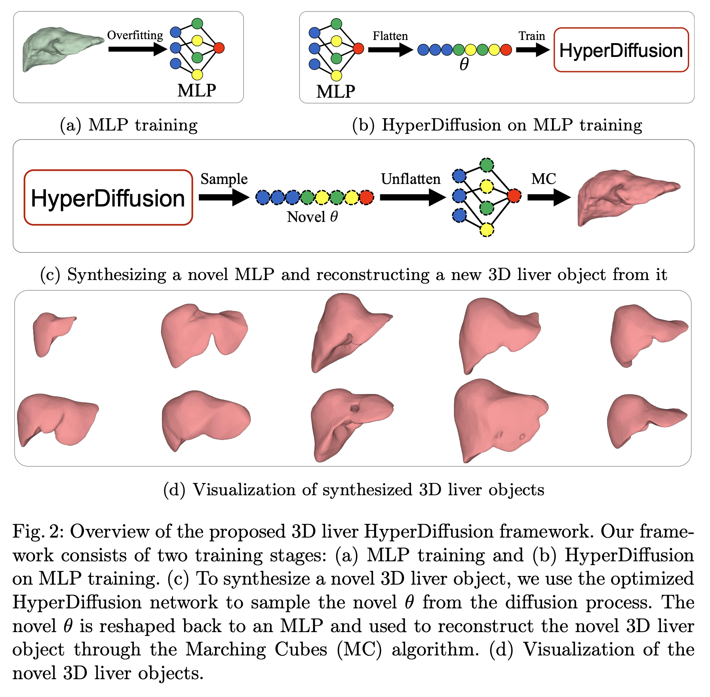
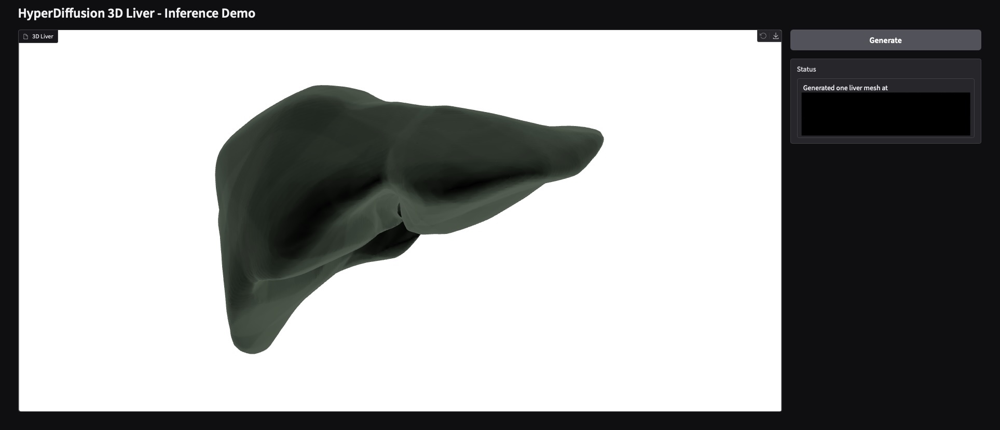

<div align="center">

# Boosting 3D Liver Shape Datasets with Diffusion Models and Implicit Neural Representations

<a href="https://papers.miccai.org/miccai-2025/0105-Paper2124.html"></a>
<a href="src/Khoa_HyperDiffusionLiver_poster.pdf"></a>
<a href="https://drive.google.com/file/d/1xE3m-0toASbgJh7V-GmIb0wxfxJK2xs2/view?usp=sharing"></a>
<a href="https://drive.google.com/file/d/1Qhvner5PICko2CM8n8DL1TedID290WpQ/view?usp=sharing"></a>
<a href="http://creativecommons.org/licenses/by-nc-sa/4.0/"></a>

<!-- <a href="https://arxiv.org/abs/2504.19402"></a> -->

</div>

This is the official implementation of the paper "Boosting 3D Liver Shape Datasets with Diffusion Models and Implicit Neural Representations" (MICCAI 2025).

Please also check out our follow-up work:
- [Toward Using Machine Learning as a Shape Quality Metric for Liver Point Cloud Generation](https://arxiv.org/abs/2508.02482)


## TL;DR


We analyze existing 3D liver shape datasets and find issues such as noisy annotations and incomplete geometry. 


To address this, we train a HyperDiffusion model on implicit neural representations to generate high-quality synthetic liver shapes.



Examples of generated liver objects throughout the training process:


## Quick Start

### 1. Clone the repository and navigate to the repository directory:

```bash
git clone https://github.com/Khoa-NT/hyperdiffusion_liver.git
cd hyperdiffusion_liver
```

From now on, we assume you are in the repository directory.


### 2. Create a conda environment and install the dependencies:

```bash
conda env create -f environment.yml
conda activate hpdf
```

### 3. Download the liver object dataset (required for training; skip if you only want to run the demo)
You can download the filtered liver objects (names, meshes, sampled point clouds) from [here](https://drive.google.com/file/d/1xE3m-0toASbgJh7V-GmIb0wxfxJK2xs2/view?usp=sharing) (about 6.2 GB after unzipping). 
Unzip the file and place it in the subfolder `data/Totalsegmentator_dataset_v201_Liver` in the repository directory:

```bash
hyperdiffusion_liver
├── ...
├── data
│   └── Totalsegmentator_dataset_v201_Liver # dataset downloaded from Google Drive
└── ...
```


<details>
<summary>Click to expand detailed structure of Totalsegmentator_dataset_v201_Liver directory</summary>

```bash
Totalsegmentator_dataset_v201_Liver
│
├── cut                                 # directory of cut liver objects
│   ├── sampled_20000
│   │   ├── mesh
│   │   │   ├── s0001_Segment_1.stl     # mesh exported from 3D Slicer
│   │   │   ├── ...
│   │   │   └── s1401_Segment_1.stl
│   │   └── npy
│   │       └── 3D_Reconstruction       # directory of sampled point clouds for training INRs
│   │           ├── s0001_Segment_1.npy # sampled point cloud from the mesh
│   │           ├── ...
│   │           └── s1401_Segment_1.npy 
│   ├── test.txt                        # list of test names
│   ├── train.txt                       # list of train names
│   └── val.txt                         # list of val names
│
├── nope            # `nope` liver objects
│   └── ...         # The same structure as `cut`
├── not_sure        # `not_sure` liver objects
│   └── ...
├── ok              # `ok` liver objects
│   └── ...
├── require_edit    # `require_edit` liver objects
│   └── ...
│
├── cut.txt             # list of cut objects
├── nope.txt            # list of nope objects
├── not_sure.txt        # list of not sure objects
├── ok.txt              # list of ok objects
└── require_edit.txt    # list of require edit objects
```

</details>


### 4. Download the HyperDiffusion and INR checkpoints (required for the demo)

You can download the HyperDiffusion and INR checkpoints from [here](https://drive.google.com/file/d/1qyettXZeU-f-3zZfrBCqetpzAz489bkH/view?usp=sharing) (about 9 GB after unzipping).
Unzip the file and place it in the subfolder `data/ckpt` of the repository directory as follows:

```bash
hyperdiffusion_liver
├── ...
├── data
│   ├── Totalsegmentator_dataset_v201_Liver # dataset downloaded in step 3
│   │   └── ...
│   │  
│   └── ckpt # checkpoints downloaded from Google Drive in this step
│       └── ...
└── ...
```


<details>
<summary>Click to expand detailed structure of ckpt directory</summary>

```bash
ckpt
├── hpdf_ckpt                   # checkpoint of HyperDiffusion
│   └── final_model.pth
│
└── inr_ckpt                    # directory of INRs trained on the liver objects for HyperDiffusion training
    └── OK_SAMPLED_20000        # HyperDiffusion is trained on INRs of liver objects in `ok` status
        ├── s0004_Segment_1     # INR of the liver object `s0004_Segment_1`
        │   ├── best_model.pth
        │   └── mesh_908.ply
        ├── ...
        ├── s1428_Segment_1     # INR of the liver object `s1428_Segment_1`
        │   ├── best_model.pth
        │   └── mesh_961.ply
        └── results.csv         # results of the INR training
```

</details>


### 5. Run the demo
We provide a Gradio demo of the HyperDiffusion model trained on liver objects.



To launch the demo, run the following command in the repository directory:

```bash
python gradio_hd_3D.py running_mode=gradio load_ckpt_path='${hydra:runtime.cwd}/data/ckpt/hpdf_ckpt/final_model.pth'
```

It uses about 6 GB of GPU memory.


## Training
 
> I haven't fully tested the training code yet. Please let me know if you encounter any issues.


### 0. Create point clouds for your custom dataset (skip if you use our liver objects)
Place your meshes (e.g., `.stl`) in one directory (e.g., `data/your_dataset`).
Run the following command to sample point clouds for your custom dataset:
```bash
python create_pc.py \
    --objs_path <path_to_your_meshes> \
    --save_root <path_to_save_point_clouds> \
    --n_sampled_points 20000 \
    --obj_suffix stl
```
The sampled point clouds will be saved in `<path_to_save_point_clouds>/all/`.


<details>
<summary>Click to expand example of sampling with selected meshes </summary>

If you want to sample point clouds for selected meshes, create a text file with the mesh names (without extensions, one per line) and pass it to `--names_file`.
For example, to sample the meshes `mesh_1.stl`, `mesh_2.stl`, and `mesh_3.stl`, create a text file with:
```txt
mesh_1
mesh_2
mesh_3
```

Then run the following command to sample point clouds for the selected meshes:
```bash
python create_pc.py \
    --objs_path <path_to_your_meshes> \
    --save_root <path_to_save_point_clouds> \
    --n_sampled_points 20000 \
    --obj_suffix stl \
    --names_file <path_to_names.txt>
```
The sampled point clouds will be saved in `<path_to_save_point_clouds>/<names_file_stem>/`.

</details>


### 1. Train the INRs on liver objects

To train on the provided `ok` liver objects:
```bash
python train_mlp_3D.py
```

To train on your meshes, set `data_path` to the `npy` folder of sampled point clouds and place the meshes in a sibling `mesh` folder:
```bash
your_dataset
├── npy
│   ├── mesh_1.npy
│   ├── mesh_2.npy
│   └── mesh_3.npy
└── mesh
    ├── mesh_1.stl
    ├── mesh_2.stl
    └── mesh_3.stl
```
Then run:
```bash
python train_mlp_3D.py data_path=<path_to_your_npy_directory>
```
Results are saved to `experiments/mlp_3D/train/yyyy_mm_dd/hh_mm_ss_mlp_3D`.


### 2. Train HyperDiffusion on the INRs

To train on the INRs we provide for the `ok` liver objects:
```bash
python train_hd_3D.py
```

To train on your INRs, set `data_path` to your trained INR directory (see `ckpt/inr_ckpt/OK_SAMPLED_20000` for reference) and `mesh_path` to your mesh directory (see `data/Totalsegmentator_dataset_v201_Liver/ok/sampled_20000/mesh`). Provide text files for train/val/test splits (see `train.txt`, `val.txt`, `test.txt` in `data/Totalsegmentator_dataset_v201_Liver/ok`).
Run:
```bash
python train_hd_3D.py \
    data_path=<path_to_your_inr_directory> \
    mesh_path=<path_to_your_mesh_directory> \
    split_path.train=<path_to_your_train.txt> \
    split_path.val=<path_to_your_val.txt> \
    split_path.test=<path_to_your_test.txt>
```
Results are saved to `experiments/hd_3D/train/yyyy_mm_dd/hh_mm_ss_hd_3D`.


## Export segmentation from 3D Slicer

We provide a script to export the segmentation from 3D Slicer automatically for selected organs in TotalSegmentator.
Please check out the repository [slicer_liver_export](https://github.com/Khoa-NT/slicer_liver_export) for more details.


## Acknowledgments
We thank the authors of the following works for their open-source implementation:
- [HyperDiffusion](https://github.com/Rgtemze/HyperDiffusion)
- [lucidrains denoising-diffusion-pytorch](https://github.com/lucidrains/denoising-diffusion-pytorch)
- [SIREN](https://github.com/vsitzmann/siren)
- [Shape As Points (SAP)](https://github.com/autonomousvision/shape_as_points)


## Citation
If you find our work useful in your research, please cite our paper:
```bibtex
@InProceedings{NguKho_Boosting_MICCAI2025,
    author = { Nguyen, Khoa Tuan and Tozzi, Francesca and Willaert, Wouter and Vankerschaver, Joris and Rashidian, Niki and De Neve, Wesley},
    title = { { Boosting 3D Liver Shape Datasets with Diffusion Models and Implicit Neural Representations } },
    booktitle = {proceedings of Medical Image Computing and Computer Assisted Intervention -- MICCAI 2025},
    year = {2025},
    publisher = {Springer Nature Switzerland},
    volume = {LNCS 15961},
    month = {September},
    page = {67 -- 77}
}
```


# License
This work is licensed under a
[Creative Commons Attribution-NonCommercial-ShareAlike 4.0 International License][cc-by-nc-sa].

[![CC BY-NC-SA 4.0][cc-by-nc-sa-image]][cc-by-nc-sa]

[cc-by-nc-sa]: http://creativecommons.org/licenses/by-nc-sa/4.0/
[cc-by-nc-sa-image]: https://licensebuttons.net/l/by-nc-sa/4.0/88x31.png
[cc-by-nc-sa-shield]: https://img.shields.io/badge/License-CC%20BY--NC--SA%204.0-lightgrey.svg